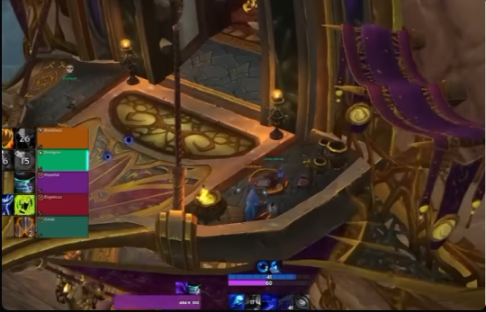

# 하늘탑
---
## MDT루트
<iframe src="https://keystone.guru/route/skyreach/csl9NGd/%ED%95%98%EB%8A%98%ED%83%91/embed" style="width: 800px; height: 600px; border: none;"></iframe>

## 패스
 - 오른쪽 팩 풀링 이후 바로 콜을 해주면 OK
 - 오른쪽 팩 풀링시 링크가 아니니까 다 오는거 확인할 것
  - 악사
    - 몹을 최대한 왼쪽으로 붙도록 풀링 (패스루트)
  - 나머지
    - 테이블이랑 화로사이에서 대기하고 들어가기
  
---
## 메모
 - 2번풀 진입시 생존기 체크 (급사가능)
 - 4번풀 몽유병으로 이격된 것 확인한 후 죽손
 - 4번풀 쉴드 생기니까 빛정령을 마무리할지 보주를 마무리할지 빠르게 판단할 것
---
## 클리어영상

22단 하늘탑 포악
<iframe width="560" height="315" src="https://www.youtube.com/embed/YOrgxhezrXc?si=-4vNnZlSBYektxMU" title="YouTube video player" frameborder="0" allow="accelerometer; autoplay; clipboard-write; encrypted-media; gyroscope; picture-in-picture; web-share" referrerpolicy="strict-origin-when-cross-origin" allowfullscreen></iframe>

22단 하늘탑 부죽
<iframe width="560" height="315" src="https://www.youtube.com/embed/8gYV3If2xiY?si=NLdC8ML7W7L__-A8" title="YouTube video player" frameborder="0" allow="accelerometer; autoplay; clipboard-write; encrypted-media; gyroscope; picture-in-picture; web-share" referrerpolicy="strict-origin-when-cross-origin" allowfullscreen></iframe>

